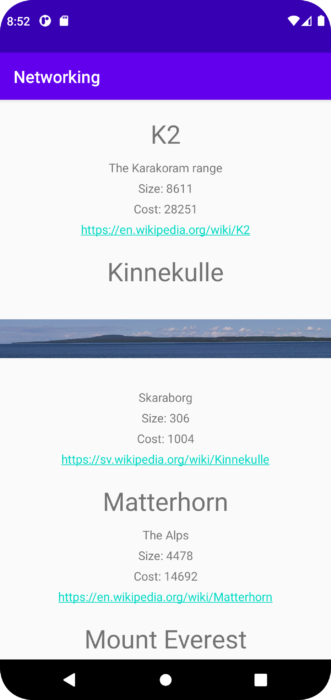

# Rapport

Skapade en recyclerview med en lista av mountains. För ett berg skapdes en klass som innehåller alla egenskaper för berget.
Ett berg har även auxdata och för detta skapades ytterligare en klass men attributen `Wiki` för länken till wikipedia och `img` för länken till bilden.

För att ladda in bilden i en imageview använde jag mig av biblioteket Picasso.


Kodstycket nedan laddar in data från json och uppdaterar listan med berg i adapter och sedan meddelar adapter att data har uppdaterats.
```
    Gson gson = new Gson();
    Type type = new TypeToken<List<Mountain>>() {}.getType();
    mountains = gson.fromJson(json, type);
    adapter.setMountains(mountains);
    adapter.notifyDataSetChanged();
```

Bilder läggs i samma mapp som markdown-filen.



Läs gärna:

- Boulos, M.N.K., Warren, J., Gong, J. & Yue, P. (2010) Web GIS in practice VIII: HTML5 and the canvas element for interactive online mapping. International journal of health geographics 9, 14. Shin, Y. &
- Wunsche, B.C. (2013) A smartphone-based golf simulation exercise game for supporting arthritis patients. 2013 28th International Conference of Image and Vision Computing New Zealand (IVCNZ), IEEE, pp. 459–464.
- Wohlin, C., Runeson, P., Höst, M., Ohlsson, M.C., Regnell, B., Wesslén, A. (2012) Experimentation in Software Engineering, Berlin, Heidelberg: Springer Berlin Heidelberg.
